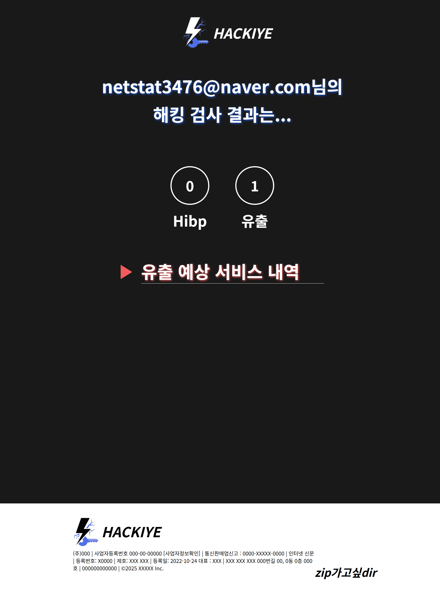

### zip가고싶dir

# 해키(Hackiye)

## 💡서비스 개요
### 사용자들이 자신들의 계정에 대한 보안 이슈를 쉽게파악하지 못하기 때문에
### 구글, 네이버 이메일을 입력 받아 관련 계정들의 보안 이슈를 쉽고 빠르게 파악할 수 있게 해주는 서비스

## 🎯타겟
- ### 구글, 네이버 이메일 계정을 사용하는 사용자

## 🏷️서비스 기능
- ### 이메일을 사용하여 보안 이슈 점검(구글 다크웹 검사, Hibp, 자체 검증 알고리즘)
  ### -> 무료 API 제공이 안되어 GUI 기반 크롤링 사용
- ### 최근 보안 이슈(2025년)가 있는 사이트 목록 안내

## ✨기술 스택
- ### 디자인&Tools : Figma, Notion, Discord, Git Hub
- ### 프론트엔드 : React(Vite), React-Router, Axios
- ### 백엔드 : Python, PyAutoGui, fastAPI

## 구현

